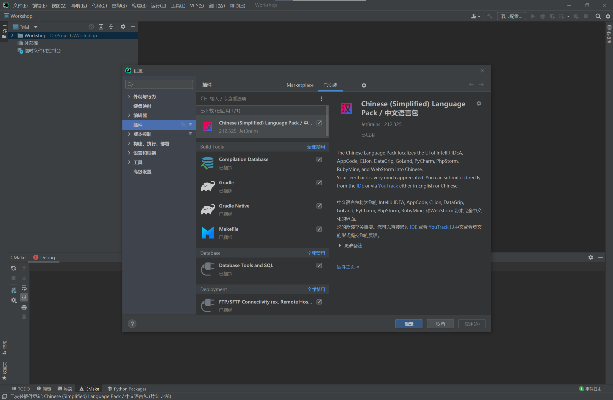

# 前言 - 如何搭建环境

本小节目录：

* [一、环境搭建](#一环境搭建)
* [二、调试插件](#二调试插件)
* [三、本地的导入和打包](#三本地的导入和打包)
* [零、IDEA的汉化](#零idea-的汉化)

---

参与编写者：MagicLu550

后期修订：愉悦师柑也

**本版本可能为非正式版本，但不影响阅读，请您悉知。**

#### 本小节建议学习时间：40 分钟；
##### 学习要点: 学会使用IDEA搭建Maven环境和Nukkit开发环境，并学习调试Nukkit项目；

---
### 一、环境搭建

搭建环境是我们学习Nukkit的第一步。虽然安装IDE不是必要的一步，但这是我们能以便捷的方式进行开发的第一步。

1. 首先上 [IDEA官网](https://www.jetbrains.com/idea/download/) 下载我们所需要的版本，我们一般选择免费的Community版本，因为它已经符合我们的需求了。作者这里使用的是Ultimate版本。


1. 打开IDEA后，我们这里使用 [Maven](https://maven.apache.org/) 项目进行构建。这里使用 [JDK1.8](https://www.oracle.com/technetwork/java/javase/downloads/jdk8-downloads-2133151.html) ，只要是图中这样的就可以了。


3.输入 *groupId* 和 *artifactId* （这些是需要你来写的，支持自定义），并且创建项目后，我们会进入到下图的界面。图中的 *artifactId* 为 **MyFirstPlugin**.


```
关于groupId为何物，Snake1999做出了非常详细的解释(转)：
这里有必要做一些详细说明。
GroupId 经常也是Java项目的包名。Java项目的包命名规则有这样的约定：
“以网站倒着写.项目名字” 或者 “网站倒着写.项目名字.模块名字” 为结构。
必须以小写字母开头，
必须与别的Java包相区别。
Nukkit内核的所有包都是遵循这个规定的，
例如Nukkit的网站是nukkit.cn，所以里面包含所有方块（block）的包的包名应该是：
cn.nukkit.block

各位在编写Nukkit插件的时候，需要编写一个独特的、和他人的项目不一样的包名，以便与他人开发的插件相区别。
比如译者的网站是snake1999.com，如果译者编写了一个叫ExamplePlugin的Nukkit插件，就可以放在包名为com.snake1999.exampleplugin的包内。以下包名的结构都是可以使用的：
com.snake1999.exampleplugin
net.mcbbs.tutorialplugin
ru.nukkit.nkexample
me.fromgate.firstplugin
而以下的包名都是不被推荐使用的：
main.java.plugin
TestPlugin

另外，开发Nukkit插件，我们规定不能把插件的任何部分存放在cn.nukkit包下，否则后果自负。

关于主类的名称，只要能和别人的主类区分开就可以了，但是不推荐使用MainClass之类的名称。
```

4. 在pom.xml中加入以下标签可以导入

```xml

<repositories>
   <repository>
            <id>opencollab-repo-release</id>
            <url>https://repo.opencollab.dev/maven-releases/</url>
            <releases>
                <enabled>true</enabled>
            </releases>
            <snapshots>
                <enabled>false</enabled>
            </snapshots>
        </repository>
        <repository>
            <id>opencollab-repo-snapshot</id>
            <url>https://repo.opencollab.dev/maven-snapshots/</url>
            <releases>
                <enabled>false</enabled>
            </releases>
            <snapshots>
                <enabled>true</enabled>
            </snapshots>
        </repository>
</repositories>
    
<dependencies>
    <dependency>
        <groupId>cn.nukkit</groupId>
        <artifactId>nukkit</artifactId>
        <version>1.0-SNAPSHOT</version>
    </dependency>
</dependencies>
```

如图所示


5. 接下来在程序上可以进行开发了

[comment]: <> (二. 项目结构)

[comment]: <> (1.nukkit的基本项目结构为)

[comment]: <> (```)

[comment]: <> (    -- project)

[comment]: <> (        -- src)

[comment]: <> (            -- main-class)

[comment]: <> (        -- resources)

[comment]: <> (            -- plugin.yml)

[comment]: <> (```)

[comment]: <> (因此我们需要创建主类和plugin.yml&#40;插件配置文件&#41;)

[comment]: <> (转自snake1999:)

[comment]: <> (    - 每个插件都有 plugin.yml 文件。)

[comment]: <> (    - 这里介绍一些设置，说明这个文件的格式。)

[comment]: <> (    - 插件没有这个文件，就不会被 Nukkit 识别和加载。)

[comment]: <> (    - 这个文件的最基本的应该是类似这样的：)
    
[comment]: <> (```yaml)
        
[comment]: <> (        name: FirstPlugin             # nukkit运行时识别的插件名)

[comment]: <> (        main: net.noyark.www.Example  # 主类名称)

[comment]: <> (        version: "0.0.1"              # 版本号)

[comment]: <> (        author: 你的名字，这里指作者名称)

[comment]: <> (        api: ["1.0.8"]                # 早期nukkit api为1.0.0，)

[comment]: <> (                                      # 目前大概为1.0.8)

[comment]: <> (        description: My first plugin  #介绍)

[comment]: <> (```)

[comment]: <> (目前大概为这种结构)

[comment]: <> (![1-05]&#40;../images/1-05.png&#41;)

[comment]: <> (但是，我们项目目前这样是不够的，Example类需要继承PluginBase才可以成为真正可以加载的主类)


[comment]: <> (```java)

[comment]: <> (package net.noyark.www;)

[comment]: <> (import cn.nukkit.plugin.PluginBase;)

[comment]: <> (public class Example extends PluginBase {)

[comment]: <> (    /**)

[comment]: <> (     * 在服务器加载完成前执行一次)

[comment]: <> (     */)

[comment]: <> (    @Override)

[comment]: <> (    public void onLoad&#40;&#41; {)
        
[comment]: <> (    })

[comment]: <> (    /**)

[comment]: <> (     * 在服务器加载完成后执行一次)

[comment]: <> (     */)

[comment]: <> (    @Override)

[comment]: <> (    public void onEnable&#40;&#41; {)
        
[comment]: <> (    })

[comment]: <> (    /**)

[comment]: <> (     * 服务器即将关闭前执行一次)

[comment]: <> (     */)

[comment]: <> (    @Override)

[comment]: <> (    public void onDisable&#40;&#41; {)
        
[comment]: <> (    })

[comment]: <> (})

[comment]: <> (```)


### 二、调试插件

###### 其实调试插件很简单，这里我们需要以下四个过程：

> 编译，打包 → 部署 → 运行加载 → 调试

1. 编译打包很简单。我们使用IDE可以轻松实现Maven打包。

PS: 在打包之前，建议在pom.xml里加上以下代码，可以解决IDEA编译器版本无效等一系列问题。
```xml
    <build>
        <plugins>
           
            <plugin>
                <groupId>org.apache.maven.plugins</groupId>
                <artifactId>maven-compiler-plugin</artifactId>
                <version>3.2</version>
                <configuration>
                    <source>1.8</source>
                    <target>1.8</target>
                    <encoding>UTF-8</encoding>
                </configuration>
            </plugin>

        </plugins>
    </build>
```
本项目所采用的JDK版本为JDK8。如果您使用的不是JDK8，则需要**修改一些地方**。

**JDK9**
```xml
    <build>
        <plugins>
           
            <plugin>
                <groupId>org.apache.maven.plugins</groupId>
                <artifactId>maven-compiler-plugin</artifactId>
                <version>3.2</version>
                <configuration>
                    <source>1.9</source>
                    <target>1.9</target>
                    <encoding>UTF-8</encoding>
                </configuration>
            </plugin>

        </plugins>
    </build>
```

**JDK10**
```xml
    <build>
        <plugins>
            
            <plugin>
                <groupId>org.apache.maven.plugins</groupId>
                <artifactId>maven-compiler-plugin</artifactId>
                <version>3.2</version>
                <configuration>
                    <source>1.10</source>
                    <target>1.10</target>
                    <encoding>UTF-8</encoding>
                </configuration>
            </plugin>

        </plugins>
    </build>
```
以此类推....如果行不通，可以尝试可以删掉前面的“1.”

比如，JDK11就是

```
<source>11</source>
<target>11</target>
```

如图所示，添加这些标签：


如图中按钮所示：


之后我们找到其中的package，点击即可。


如图所示，出现 **"BUILD SUCCESS"** ，编译就大功告成了。


一般来讲，**目标jar包**会产生在 target 文件夹中。


1. 部署

之后把打包好的合法插件丢入plugins文件里就完美运行了，这里将不做图示
这就是插件部署的过程。

3. 运行加载

如果出现了加载$(您的插件名字)成功之类的字样，说明您的插件成功了。

4. 之后进入游戏测试您的插件是否符合您的需求，根据您插件出现的各种问题进行再次调试、修改、打包等。

### 三、本地的导入和打包

鉴于很多人的需要（因为NukkitX的Maven服务器太卡了），这里我写一下本地导入jar包的方法。

1. 导入包

其实要简单很多，您需要上 [NukkitX的Jenkins](https://ci.nukkitx.com/job/NukkitX/job/Nukkit/job/master/) 下载一个 Nukkit 的jar包，

然后将您的jar包放到您项目根目录的libs文件夹下（这里您需要自己创建）


我们再把它导入我们的项目里，

这里选择 libraries：


选择Java，这样可以直接导入本地jar包。


之后我们选择下载好的Nukkit的jar包，


导入完毕，


1. 构建jar包

再然后，我们在libs下创建一个plugins文件夹（先前的点击下面的OK保存一下），


打开我们的这个窗口，找到artifacts，之后点击 '+' ，找到 JAR，


创建之后，是这样子（图中已经说明了compile output）。


然后如图中所示，把 plugin.yml 也添加到我们的jar包里


之后我们再修改打包目标的路径，将路径指向我们jar包的根目录


记得设置上这个：


保存。


3. 设置工作文件夹

最后一步，设置我们的运行环境。如图所示，点击Add Configuration


接着，我们分别设置jar包和工作文件夹


最后优雅的点击保存。


4. 运行

我们在这儿先写个主类


再点击 Build，打包插件


之后我们把插件放进服务器中跑一遍，


成功√


### 零、IDEA的汉化

~~感谢 Testfor , Itname 等人的帮助，我们找到了 IDEA 的汉化包，[点击这里下载](https://github.com/pingfangx/TranslatorX)~~

上面的汉化包适用于2019.3，

截至2021年10月28日，IDEA Community 已经更新至2021.2.3，

**且官方已支持使用插件进行页面汉化。**

以 *愉悦师柑也* 的 *CLion 2021.2.2* 为例，您可以直接前往 **Settings - Plugins** 搜素 *Chinese* 并安装。



~~NTR了，但没有完全NTR~~

[下一节](../第一章/1-0_前言.md)


### 参考文献
- [[教程] [官方] 使用Maven配置Nukkit开发环境的方法（部分）](https://www.mcbbs.net/thread-706178-1-1.html)
- [Nukkit插件从0开始](https://www.cnblogs.com/xtypr/p/nukkit_plugin_start_from_0.html)
- [[教程] [转载] 如何开始制作 Nukkit 插件? Fromgate 的插件教程来了! [长文|多图] ](https://www.mcbbs.net/forum.php?mod=viewthread&tid=552265&page=1&authorid=100001)
